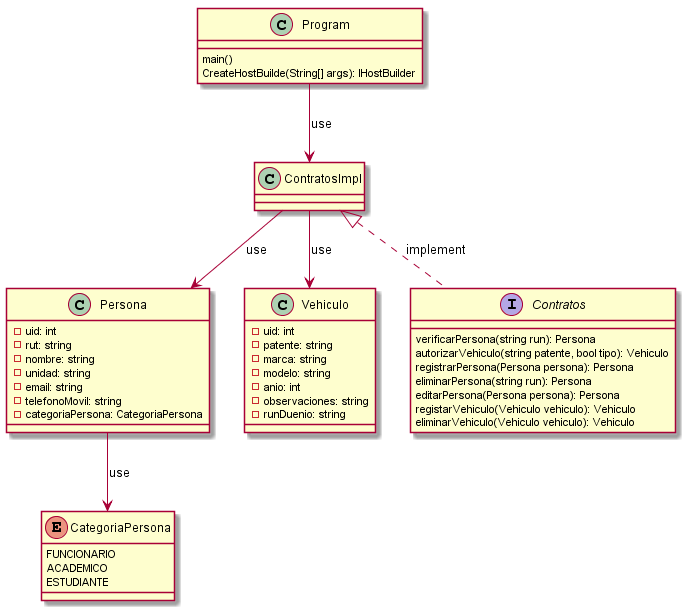

# ParkingUCN 
Project ParkingUCN for the signature Proyecto De Desarrollo e Integración de Soluciones, UCN.

##  
[Eduardo Alexis Alvarez Saldivia](https://github.com/edoxazul/) -      <eas010@alumnos.ucn.cl>

[Alvaro Lucas Castillo Calabacero](https://github.com/AlvaroCC96) -      <alvaro.castillo@alumnos.ucn.cl>

[Ignacio Fuenzalida Veas](https://github.com/NaChOoV) -      <ignacio.fuenzalida@alumnos.ucn.cl>

## Sections
* [Agenda-Scrapper](./agenda-scrapper)
* [Android APP](./parkingApp)
* [Web](./parkingWeb)
* [Back-end](./parkingBackend)

## UML

--- 
@startuml
class Persona{
    -uid: int
    -rut: string
    -nombre: string
    -unidad: string
    -email: string
    -telefonoMovil: string
    -categoriaPersona: CategoriaPersona
}

enum CategoriaPersona{
    FUNCIONARIO
    ACADEMICO
    ESTUDIANTE
}

class Vehiculo{
    -uid: int
    -patente: string
    -marca: string
    -modelo: string
    -anio: int
    -observaciones: string
    -runDuenio: string
}

class Program {
    main()
    CreateHostBuilde(String[] args): IHostBuilder
}

interface Contratos {
    verificarPersona(string run): Persona
    autorizarVehiculo(string patente, bool tipo): Vehiculo
    registrarPersona(Persona persona): Persona
    eliminarPersona(string run): Persona
    editarPersona(Persona persona): Persona
    registarVehiculo(Vehiculo vehiculo): Vehiculo
    eliminarVehiculo(Vehiculo vehiculo): Vehiculo
}
class ContratosImpl {

}

Program --> ContratosImpl: use
ContratosImpl --> Persona: use
ContratosImpl --> Vehiculo: use
Persona --> CategoriaPersona : use
ContratosImpl<|.. Contratos: implement
@enduml