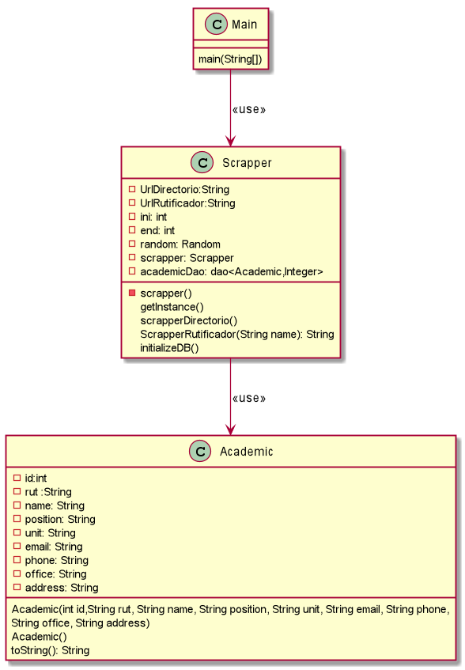

# Agenda-scrapper
Example webscrapper with jsoup for the signature Proyecto De Desarrollo e Integración de Soluciones, UCN.

## Method 1 
Save data in csv file

## Method 2
Save data in a Sqlite database (by Patricio Araya)

##  
Eduardo Alexis Alvarez Saldivia

Alvaro Lucas Castillo Calabacero

Ignacio Fuenzalida Veas

## UML

--- 
@startuml
class Main{
    main(String[])
}

class Scrapper {
    - UrlDirectorio:String
    - UrlRutificador:String
    - ini: int
    - end: int
    - random: Random
    - scrapper: Scrapper
    - academicDao: dao<Academic,Integer>
    
    - scrapper()
    getInstance()
    scrapperDirectorio()
    ScrapperRutificador(String name): String
    initializeDB()
}

class Academic{
    - id:int 
    - rut :String 
    - name: String 
    - position: String 
    - unit: String 
    - email: String 
    - phone: String 
    - office: String 
    - address: String 
    Academic(int id,String rut, String name, String position, String unit, String email, String phone,
                      String office, String address)
    Academic()
    toString(): String
}

Main --> Scrapper : <<use>>
Scrapper --> Academic :<<use>>
@enduml