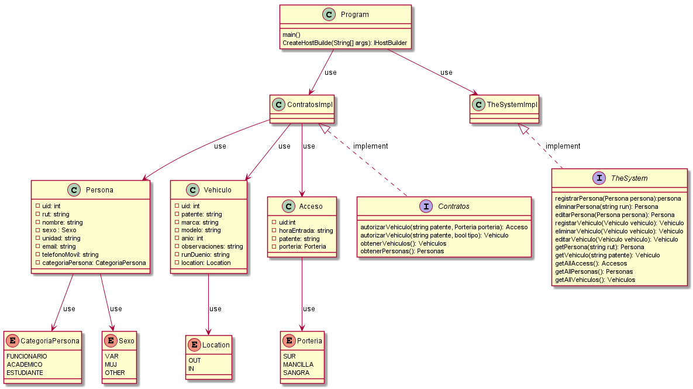

# Backend ParkingUCN

Backend del proyecto ParkingUCN para el curso de Desarrollo e Integración De Soluciones, UCN.

## Techologies
    .NET Core 3.1
 
## Authors  
[Eduardo Alexis Alvarez Saldivia](https://github.com/edoxazul/) -      <eas010@alumnos.ucn.cl>

[Alvaro Lucas Castillo Calabacero](https://github.com/AlvaroCC96) -      <alvaro.castillo@alumnos.ucn.cl>

[Ignacio Fuenzalida Veas](https://github.com/NaChOoV) -      <ignacio.fuenzalida@alumnos.ucn.cl>

## UML - Diagrama de Clases

--- 
<details><summary>PlantUML</summary>
<p>

```


@startuml
class Persona{
    -uid: int
    -rut: string
    -nombre: string
    -sexo : Sexo
    -unidad: string
    -email: string
    -telefonoMovil: string
    -categoriaPersona: CategoriaPersona
}

enum CategoriaPersona{
    FUNCIONARIO
    ACADEMICO
    ESTUDIANTE
}

enum Sexo{
    VAR
    MUJ
    OTHER
}

enum Location{
    OUT
    IN
}

enum Porteria{
    SUR
    MANCILLA
    SANGRA
}

class Vehiculo{
    -uid: int
    -patente: string
    -marca: string
    -modelo: string
    -anio: int
    -observaciones: string
    -runDuenio: string
    -location: Location
    
}

class Acceso{
    -uid:int
    -horaEntrada: string
    -patente: string
    -porteria: Porteria
}

class Program {
    main()
    CreateHostBuilde(String[] args): IHostBuilder
}

interface Contratos {
    autorizarVehiculo(string patente, Porteria porteria): Acceso
    autorizarVehiculo(string patente, bool tipo): Vehiculo
    obtenerVehiculos(): Vehiculos
    obtenerPersonas(): Personas
     
}
class ContratosImpl {

}

interface TheSystem {
    registrarPersona(Persona persona):persona
    eliminarPersona(string run): Persona
    editarPersona(Persona persona): Persona
    registarVehiculo(Vehiculo vehiculo): Vehiculo
    eliminarVehiculo(Vehiculo vehiculo): Vehiculo
    editarVehiculo(Vehiculo vehiculo): Vehiculo
    getPersona(string rut): Persona
    getVehiculo(string patente): Vehiculo
    getAllAccess(): Accesos
    getAllPersonas(): Personas
    getAllVehiculos(): Vehiculos

}

class TheSystemImpl{

}

Program --> ContratosImpl: use
Program --> TheSystemImpl: use
ContratosImpl --> Persona: use
ContratosImpl --> Vehiculo: use
ContratosImpl --> Acceso: use
Persona --> CategoriaPersona: use
Persona --> Sexo: use
Vehiculo --> Location: use
Acceso --> Porteria: use
ContratosImpl<|.. Contratos: implement
TheSystemImpl<|.. TheSystem: implement
@enduml

```

</p>
</details>