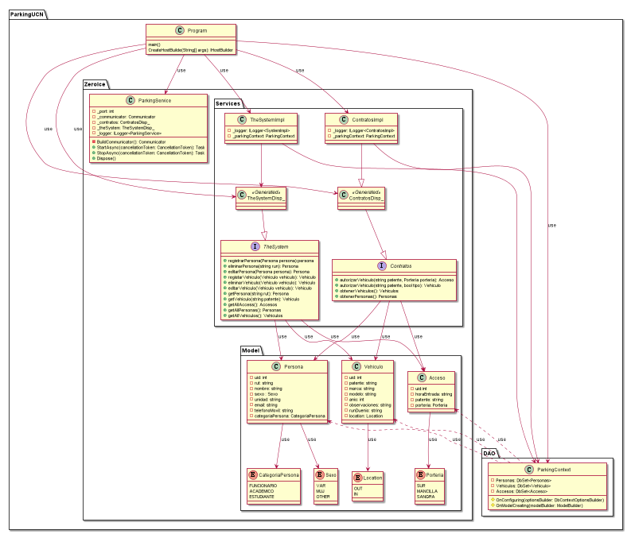

# Backend ParkingUCN

Backend del proyecto ParkingUCN para el curso de Desarrollo e Integración De Soluciones, UCN.

## Techologies
[.NET Core 3.1](https://dotnet.microsoft.com/)
    
## .NET Libraries

* [Microsoft.EntityFrameworkCore](https://www.nuget.org/packages/Microsoft.EntityFrameworkCore/)
* [Microsoft.EntityFrameworkCore.Sqlite](https://www.nuget.org/packages/Microsoft.EntityFrameworkCore.Sqlite/)
* [Microsoft.Extensions.Hosting](https://www.nuget.org/packages/Microsoft.Extensions.Hosting/)
* [Microsoft.Extensions.DependencyInjection](https://www.nuget.org/packages/Microsoft.Extensions.DependencyInjection/)
* [Microsoft.Extensions.Logging](https://www.nuget.org/packages/Microsoft.Extensions.Logging/)
* [Microsoft.Extensions.Logging.Console](https://www.nuget.org/packages/Microsoft.Extensions.Logging.Console/)
* [zeroc.ice.net](https://www.nuget.org/packages/zeroc.ice.net/)
* [zeroc.icebuilder.msbuild](https://www.nuget.org/packages/zeroc.icebuilder.msbuild/)

## Authors  
[Eduardo Alexis Alvarez Saldivia](https://github.com/edoxazul/) -      <eas010@alumnos.ucn.cl>

[Alvaro Lucas Castillo Calabacero](https://github.com/AlvaroCC96) -      <alvaro.castillo@alumnos.ucn.cl>

[Ignacio Fuenzalida Veas](https://github.com/NaChOoV) -      <ignacio.fuenzalida@alumnos.ucn.cl>

## UML - Diagrama de Clases

--- 
<details><summary>PlantUML</summary>
<p>

```


@startuml

package ParkingUCN{

    package DAO{

       class ParkingContext {

       - Personas: DbSet<Personas>
       - Vehiculos: DbSet<Vehiculo>
       - Accesos: DbSet<Acceso>
       # OnConfiguring(optionsBuilder: DbContextOptionsBuilder)
       # OnModelCreating(modelBuilder: ModelBuilder)

       }
    }


package ZeroIce{
    
    package Model{

    class Persona{
    -uid: int
    -rut: string
    -nombre: string
    -sexo : Sexo
    -unidad: string
    -email: string
    -telefonoMovil: string
    -categoriaPersona: CategoriaPersona
    }

    enum CategoriaPersona{
    FUNCIONARIO
    ACADEMICO
    ESTUDIANTE
    }

    enum Sexo{
    VAR
    MUJ
    OTHER
    }

    enum Location{
    OUT
    IN
    }

    enum Porteria{
    SUR
    MANCILLA
    SANGRA
    }

    class Vehiculo{
    -uid: int
    -patente: string
    -marca: string
    -modelo: string
    -anio: int
    -observaciones: string
    -runDuenio: string
    -location: Location
    
    } 

    class Acceso{
    -uid:int
    -horaEntrada: string
    -patente: string
    -porteria: Porteria
    }
}

    class ParkingService {
        - _port: int
        - _communicator: Communicator            
        - _contratos: ContratosDisp_
        - _theSystem: TheSystemDisp_
        - _logger: ILogger<ParkingService>
        - BuildCommunicator(): Communicator
        + StartAsync(cancellationToken: CancellationToken): Task
        + StopAsync(cancellationToken: CancellationToken): Task
        + Dispose()            
    }

    package Services {        


            interface Contratos {
                +autorizarVehiculo(string patente, Porteria porteria): Acceso
                +autorizarVehiculo(string patente, bool tipo): Vehiculo
                +obtenerVehiculos(): Vehiculos
                +obtenerPersonas(): Personas     
            
            }
            class ContratosDisp_ <<Generated>> {
            }
            ContratosDisp_ --|> Contratos

            class ContratosImpl {
                - _logger: ILogger<ContratosImpl>
                - _parkingContext: ParkingContext
            }           
            

            interface TheSystem {
                +registrarPersona(Persona persona):persona
                +eliminarPersona(string run): Persona
                +editarPersona(Persona persona): Persona
                +registarVehiculo(Vehiculo vehiculo): Vehiculo
                +eliminarVehiculo(Vehiculo vehiculo): Vehiculo
                +editarVehiculo(Vehiculo vehiculo): Vehiculo
                +getPersona(string rut): Persona
                +getVehiculo(string patente): Vehiculo
                +getAllAccess(): Accesos
                +getAllPersonas(): Personas
                +getAllVehiculos(): Vehiculos

            }
            
            class TheSystemDisp_ <<Generated>> {
            }

            TheSystemDisp_ --|> TheSystem


        class TheSystemImpl{
                - _logger: ILogger<SystemImpl>
                - _parkingContext: ParkingContext
        }


        

        Persona <.. ParkingContext: use
        Vehiculo <.. ParkingContext: use
        Acceso <.. ParkingContext: use
    }
    


}

class Program {
    main()
    CreateHostBuilde(String[] args): IHostBuilder
}

Program --> ContratosImpl: use
Program --> ContratosDisp_: use
Program --> TheSystemImpl: use
Program --> TheSystemDisp_: use
Program --> ParkingService: use
Program --> ParkingContext: use


Contratos --> Persona: use
Contratos --> Vehiculo: use
Contratos --> Acceso: use

TheSystem --> Persona: use
TheSystem --> Vehiculo: use
TheSystem --> Acceso: use


Persona --> CategoriaPersona: use
Persona --> Sexo: use
Vehiculo --> Location: use
Acceso --> Porteria: use


ContratosImpl --> ParkingContext
ContratosImpl --|> ContratosDisp_


TheSystemImpl --> ParkingContext
TheSystemImpl --> TheSystemDisp_

}
@enduml

```

</p>
</details>