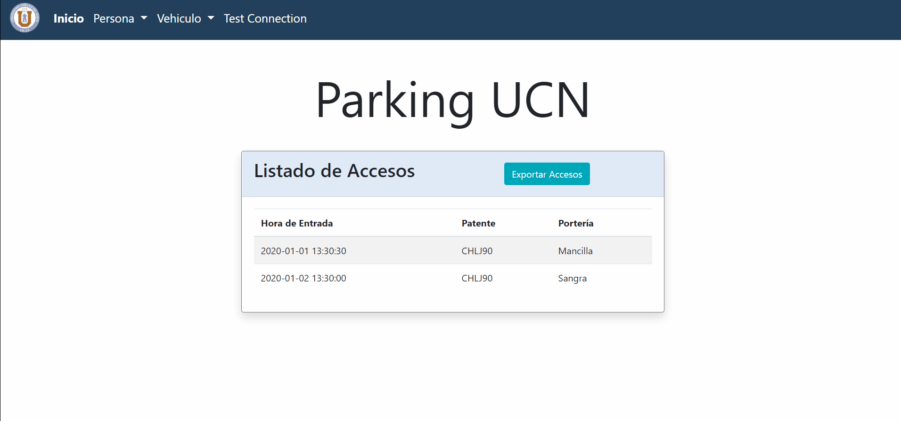

# ParkingUCN WEB
Webpage with laravel for the signature Proyecto De Desarrollo e Integración de Soluciones, UCN.

## Libraries

* LaravelCollective HTML 

    composer require laravelcollective/html
    
* Laravel Excel

    composer require maatwebsite/excel

* Bootstrap

## Technologies

* [Laravel 7.25.0 ](https://laravel.com/docs/7.x)
* [Ice 3.7.4](https://zeroc.com/downloads/ice)
* PHP 7.3.20 with ice module
* [PhpStorm](https://www.jetbrains.com/es-es/phpstorm/) 
* [Visual Studio Code - Insiders 1.49](https://code.visualstudio.com/insiders/)

## Demo

## Authors
[Eduardo Alexis Alvarez Saldivia](https://github.com/edoxazul/) -      <eas010@alumnos.ucn.cl>

[Alvaro Lucas Castillo Calabacero](https://github.com/AlvaroCC96) -      <alvaro.castillo@alumnos.ucn.cl>

[Ignacio Fuenzalida Veas](https://github.com/NaChOoV) -      <ignacio.fuenzalida@alumnos.ucn.cl>